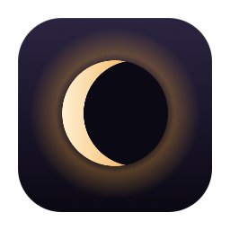

<div align="center" style="display: flex; align-items: center; justify-content: center; gap: 20px;">
  
  <h1 style="margin: 0;">BarBlackout</h1>
</div>


## 🌑 About

**BarBlackout** hides your macOS menu bar on a timer — and brings it back on its own.

Rather than toggling a system setting, it draws a borderless black window one level
above the menu bar, so nothing about your Mac's configuration is changed and the bar
returns the instant the overlay drops. Move the cursor into the menu-bar zone and the
overlay steps aside so you can still use the real menu bar, then re-covers on mouse-out.

## ✨ Features

- ⏱️ **Timed blackouts:** presets at 15m / 30m / 45m / 1h / 2h / 4h, a custom slider
  from 0–24 hours in 15-minute steps, or `∞` to hide indefinitely.
- 🎯 **Context-aware modes:**
  - `always` — blackout regardless of what's on screen.
  - `desktopOnly` — blackout on the desktop, step aside in full screen.
  - `fullScreenOnly` — blackout only inside a full-screen Space.
  - `videoOnly` — blackout only when video is actually playing in full screen.
- 🎥 **Real video detection:** checks that a known player is frontmost **and** holding
  a display-sleep assertion, so pausing or switching apps releases the overlay. A short
  grace period keeps the bar from strobing during ad breaks and seeking.
- 🖥️ **Full-screen aware:** reads the active Space type from the window server, which
  needs no Accessibility or Screen Recording permission.
- 👆 **Hover to reveal:** the overlay yields when your cursor enters the menu-bar zone,
  including for the app's own status item.
- 🌘 **The icon is the timer:** the status mark is a ring that fills from its right edge
  as the countdown runs — empty while blacked out, a solid disc once the bar is back.
- 🪶 **Stays out of the way:** runs as a background agent (`LSUIElement`), no Dock icon.

## 🛠️ Technology Stack

| Layer             | Tools & Frameworks                                                        |
| ----------------- | ------------------------------------------------------------------------- |
| **Language**      | Swift                                                                     |
| **UI**            | SwiftUI • AppKit • `NSStatusItem` • `NSBezierPath` (status icon drawing)   |
| **State**         | Combine • `ObservableObject` • `UserDefaults`                              |
| **System**        | IOKit power assertions • Core Graphics • SkyLight (private, Space type)    |
| **Build**         | Xcode • `xcodebuild`                                                       |
| **Platform**      | macOS                                                                     |

## ⚠️ A note on private API

Full-screen detection uses the private `CGSCopyManagedDisplaySpaces` /
`_CGSDefaultConnection` entry points, resolved at runtime via `dlsym` so a missing
symbol degrades to "not full screen" rather than failing to launch.

This is deliberate — the menu-bar reserve does **not** change inside a full-screen
Space, and a display-sized layer-0 window doesn't appear in `CGWindowList` either, so
neither public signal works. The trade-off is that **the app is not App Store safe**
as written.

## 🚀 Building

```bash
git clone <this-repo>
cd BarBlackout
open BarBlackout.xcodeproj
```

Then run the `BarBlackout` scheme. Or from the command line:

```bash
xcodebuild -project BarBlackout.xcodeproj -scheme BarBlackout -configuration Debug build
```
